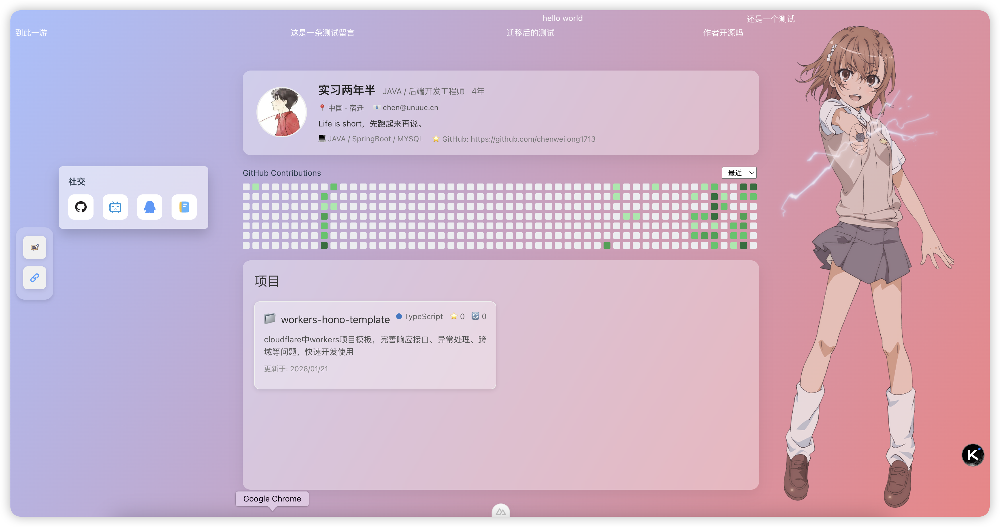

# Nuxt-Zixin 个人主页

这是一个基于 **Nuxt 4** 开发的现代化个人主页项目，专为部署在 **Cloudflare** 生态系统而设计。它利用 Cloudflare 的边缘计算能力，结合 D1 数据库和 KV 存储，提供高性能、低延迟的访问体验。

## 截图



## 演示地址

- **[Nuxt-Zixin 个人主页](https://unuuc.cn)**

## ✨ 特性

- **⚡️ 极速体验**: 基于 Nuxt 4 和 Cloudflare Workers/Pages 构建，边缘渲染。
- **🎨 桌面风格 UI**: 独特的桌面式布局，支持可拖拽的贴纸 (Stickers) 和窗口系统。
- **💾 数据存储**:
  - **Cloudflare D1**: 用于存储持久化数据（如留言板等）。
  - **Cloudflare KV**: 用于缓存 GitHub 贡献图、仓库信息等，加速加载。
- **🛠️ 高度可配置**: 所有个人信息、友链、贴纸等均可通过配置文件轻松修改。
- **📱 类似于windows窗口**: 留言、友链类似于windows窗口，不一样的体验。
- **🔄 实时更新**: 利用 Cloudflare Workers 实现实时数据更新
- **📱 Github公开数据**: 通过配置github_token,可获取自己提交统计数据和公开的仓库信息。

## 🛠 技术栈

- **框架**: [Nuxt 4](https://nuxt.com/) (Vue 3)
- **部署平台**: [Cloudflare Workers](https://workers.cloudflare.com/) / Pages
- **数据库**: [Cloudflare D1](https://developers.cloudflare.com/d1/)
- **缓存/存储**: [Cloudflare KV](https://developers.cloudflare.com/kv/)
- **样式**: CSS Modules / Scoped CSS
- **包管理**: pnpm / npm / yarn

## 🚀 快速开始

### 1. 克隆/Fork 项目

直接 Fork 本仓库到你的 GitHub，或者克隆到本地：

```bash
git clone https://github.com/your-username/cf-nuxt-zixin.git
cd cf-nuxt-zixin
```

### 2. 安装依赖

```bash
pnpm install
```

### 3. 配置 Cloudflare 资源

你需要安装并登录 Wrangler：

```bash
npm install -g wrangler
wrangler login
```

#### 创建 KV 命名空间

```bash
wrangler kv:namespace create GITHUB_KV
```
记下输出的 `id`，并在 `wrangler.jsonc` 中替换。

#### 创建 D1 数据库

```bash
wrangler d1 create COMMON_HTTP_DB
```
记下输出的 `database_id`，并在 `wrangler.jsonc` 中替换。

### 4. 配置文件修改

#### `wrangler.jsonc`

在根目录下找到 `wrangler.jsonc`，根据你的环境修改以下配置：

```jsonc
{
  // ...
  "vars": {
    // 你的 GitHub Token，用于获取仓库和贡献数据 (推荐使用细粒度 Token，只读权限)
    "GITHUB_TOKEN": "your_github_token_here"
  },
  "kv_namespaces": [
    {
      "binding": "GITHUB_KV",
      "id": "your_kv_id_here", // 替换为你创建的 KV ID
      "remote": true
    }
  ],
  "d1_databases": [
    {
      "binding": "COMMON_HTTP_DB",
      "database_name": "COMMON_HTTP_DB",
      "database_id": "your_d1_database_id_here", // 替换为你创建的 D1 ID
      "remote": true
    }
  ]
}
```

#### `app/config/zixin.config.ts`

这是项目的主要配置文件，你可以在这里修改个人信息、贴纸、友链等。

```typescript
// app/config/zixin.config.ts

// 1. 个人信息配置
export const profile: UserProfile = {
    avatar: 'https://your-avatar-url.com',
    nickname: '你的昵称',
    job: '职位 / 描述',
    // ... 其他信息
}

// 2. 贴纸配置 (支持分组和自定义位置)
export const stickerGroups: StickerGroup[] = [
    {
        title: '社交',
        items: [ /* ... */ ],
        position: { x: 120, y: 80 }
    }
]

// 3. 友链配置
export const friendLinks: FriendLink[] = [
    // ...
]
```

### 5. 本地开发

```bash
pnpm dev
```

### 6. 部署

由于配置了 Cloudflare 适配器，你可以直接运行：

```bash
pnpm build
pnpm run deploy
```
或者连接 GitHub 仓库到 Cloudflare workers 进行自动部署（ 强烈推荐 ）。

## 📂 目录结构

- `app/`: Nuxt 应用源码
  - `config/`: **核心配置文件 (`zixin.config.ts`)**
  - `pages/`: 页面路由
  - `components/`: Vue 组件
  - `stores/`: Pinia 状态管理
- `server/`: 服务端 API (Cloudflare Workers)
- `wrangler.jsonc`: **Cloudflare 部署配置**

## 📄 License

MIT
